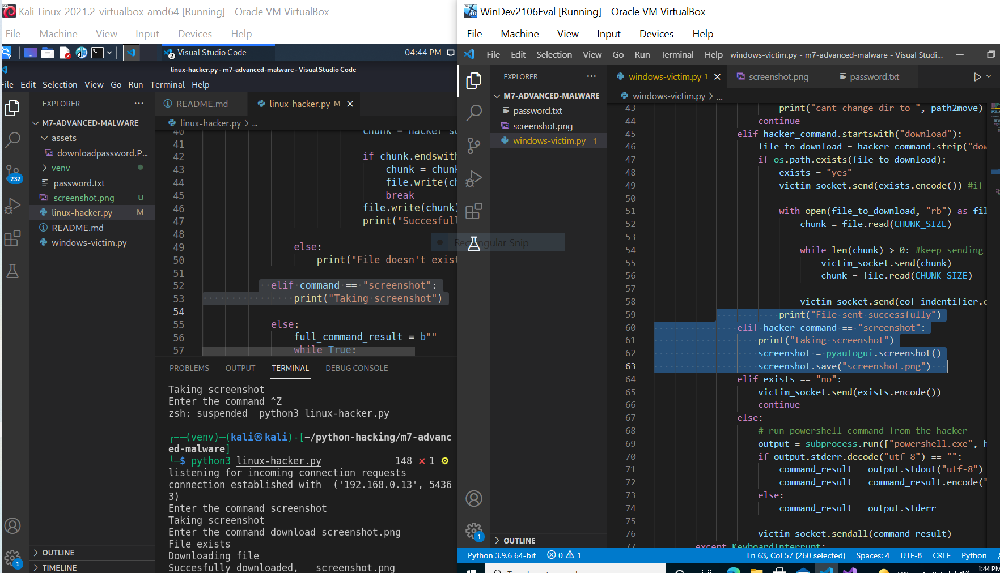

# filetransferRAT

Transfer a file and a screeshot file located on the victim's machine to the hacker's machine with Remote Access Tool using PYTHON sockets, subprocesses and THE pyautogui.

***File (screenshot) transfer:***

